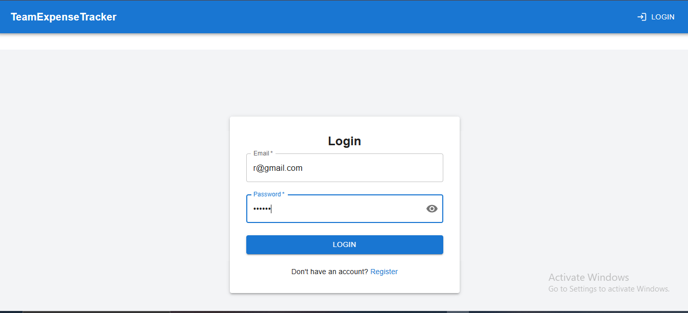
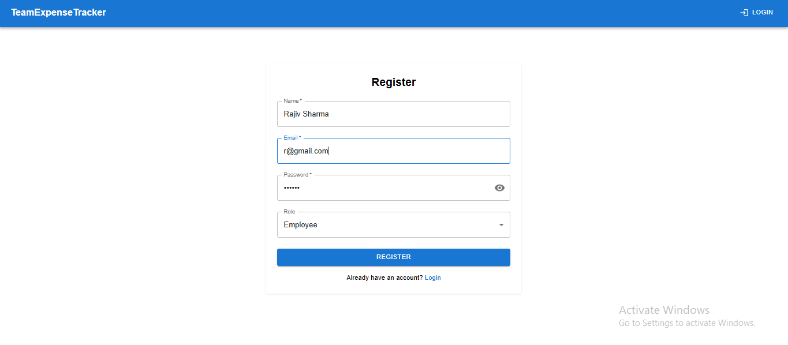
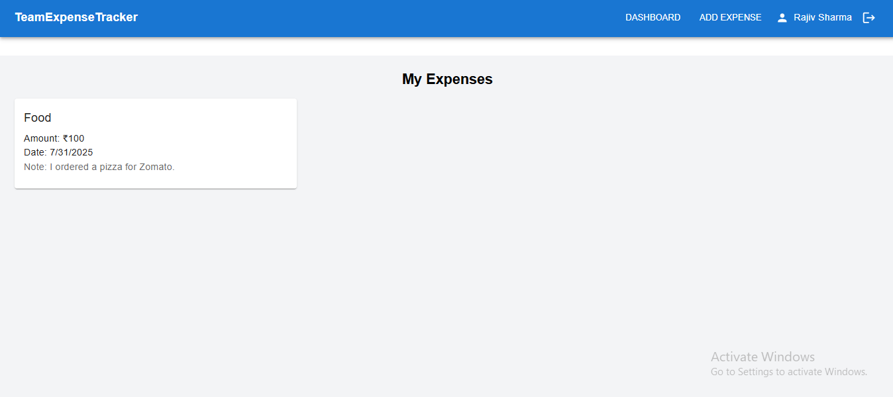
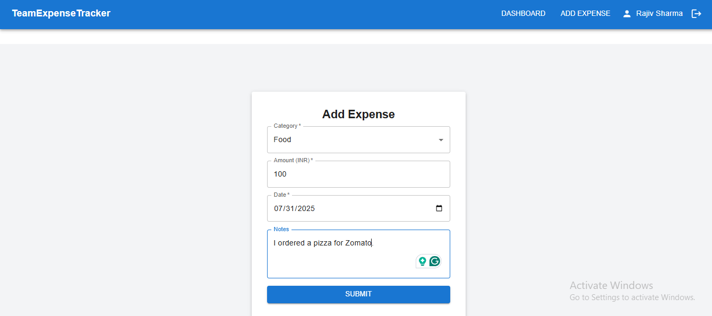
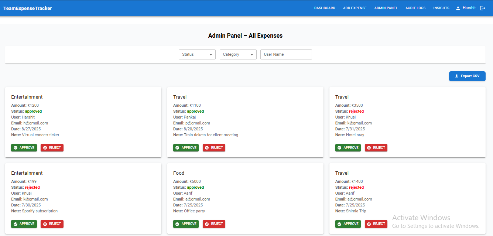
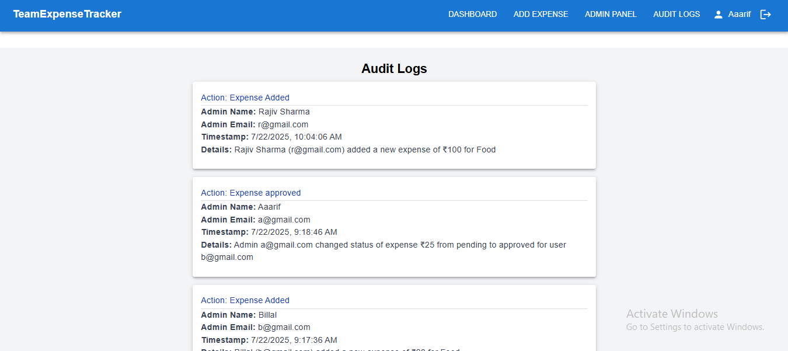

# Expense Tracker 💸

A full-stack MERN (MongoDB, Express, React, Node.js) application to manage and track your personal expenses with authentication, category-wise tracking, and dashboards.

---

## 🚀 Live Links

- 🔗 **Frontend (Vercel)**: [https://expense-tracker-topaz-six.vercel.app](https://expense-tracker-topaz-six.vercel.app)
- 🔗 **Backend (Render)**: [https://expense-tracker-ooym.onrender.com](https://expense-tracker-ooym.onrender.com)
- 🔗 **GitHub Repository**: [https://github.com/sharmaHarshit2000/expense-tracker](https://github.com/sharmaHarshit2000/expense-tracker)

---

## 📦 Features

- User Registration & Login (JWT-based)
- Add/Edit/Delete Expenses
- Expense filtering by date/category
- Dashboard with total and recent expenses
- Responsive UI using Material UI / TailwindCSS
- Toast notifications for feedback

---

## 🧰 Tech Stack

- **Frontend:** React, Redux Toolkit, TailwindCSS or MUI, Axios
- **Backend:** Node.js, Express.js, MongoDB, Mongoose, JWT
- **Deployment:** Render (Backend), Vercel/Render (Frontend)

---

## 🚀 Getting Started

### 1. Clone the Repository

```bash
git clone https://github.com/sharmaHarshit2000/expense-tracker.git
cd expense-tracker
```

### 2. Backend Setup

```bash
cd backend
npm install
```

Create a `.env` file in `backend/`:

```env
PORT=5000
MONGO_URI=your_mongo_db_uri
JWT_SECRET=your_jwt_secret
```

Start the backend:

```bash
npm run dev
```

### 3. Frontend Setup

```bash
cd frontend
npm install
```

Create a `.env` file in `frontend/`:

```env
VITE_API_BASE_URL=https://your-backend-service.onrender.com/api
```

Start the frontend:

```bash
npm run dev
```

---

## ⚙️ Deployment

### Backend (Render):

- Connect GitHub repo
- Add Environment Variables (`MONGO_URI`, `JWT_SECRET`)
- Set build command: `npm install`
- Set start command: `node index.js` or `npm start`

### Frontend (Vercel or Render):

- Set `VITE_API_BASE_URL` to backend's deployed URL
- Set build command: `npm run build`
- Output directory: `dist` (for Vite)

---

## 📁 Folder Structure

```
expense-tracker/
├── backend/
│ ├── server.js
│ ├── config/
│ ├── middlewares/
│ │ ├── authMiddleware.js
│ │ ├── errorHandler.js
│ │ └── notFound.js
│ ├── routes/
│ │ ├── authRoutes.js
│ │ ├── expenseRoutes.js
│ │ └── auditRoutes.js
│ ├── controllers/
│ │ ├── authController.js
│ │ ├── expenseController.js
│ │ └── auditController.js
│ ├── models/
│ │ ├── User.js
│ │ ├── Expense.js
│ │ └── AuditLog.js
│ └── utils/
│ └── generateToken.js
│
├── frontend/
│ ├── App.jsx
│ ├── main.jsx
│ ├── components/
│ │ ├── Header.jsx
│ │ ├── ProtectedRoute.jsx
│ │ ├── Footer.jsx
│ ├── pages/
│ │ ├── LoginPage.jsx
│ │ ├── RegisterPage.jsx
│ │ ├── Dashboard.jsx
│ │ ├── AdminPanel.jsx
│ │ ├── ExpenseForm.jsx
│ │ └── AuditLogs.jsx
│ ├── context/
│ │ └── AuthContext.jsx
│ ├── api/
│ │ ├── auth.js
│ │ ├── audit.js
│ │ ├── expense.js
│ │ └── axios.js
│
├── screenshots/
│ ├── login.png
│ ├── register.png
│ ├── dashboard.png
│ ├── expenses.png
│ ├── admin-panel.png
│ └── audit-logs.png
```

---

## 🖼️ Screenshots

> To view the dashboard and admin panel, you must login as an **admin**.

| Login | Register | Dashboard |
|-------|----------|-----------|
|  |  |  |

| Expenses | Admin Panel | Audit Logs |
|----------|-------------|-------------|
|  |  |  |

---

## 🧑‍💻 Author

**Harshit Sharma**  
📧 harshitsharma9989@gmail.com  
📞 9369966830  
🔗 [GitHub Profile](https://github.com/sharmaHarshit2000)
